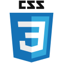
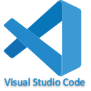
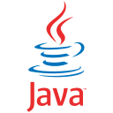
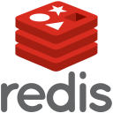
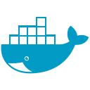

**Welcome to Howard's basement  👋**
<!--
**howardding2000/howardding2000** is a ✨ _special_ ✨ repository because its `README.md` (this file) appears on your GitHub profile.

Here are some ideas to get you started: -->

**Here some informations about me:**  
---
- Bachelor degree in software engineering:man_student:
- 2 years feature phone :iphone: development experience （ancient technology :sweat_smile:	）
- 6 years project management experiencein in mobile device manufacturing（PMP Certification）:briefcase::necktie::pencil:
- DEP of Machining Technique ( cours en français):toolbox::hammer_and_wrench::gear:
- __I’m recently searching a job as a web frontend developer__:heart_eyes::heart_eyes::heart_eyes:
- Welcome to visite my website <a href="https://www.buding.ca">buding.ca</a>, although it's still under construction :sweat_smile::sweat_smile::sweat_smile:
<!-- __I’m currently coding with Reactjs, TypeScript, Nextjs, Chakra UI__ :computer::computer_mouse::muscle:-->
**Languages and Tools:**  
---

<a href="#"></a>
<a href="#"></a>
<a href="#"></a>
<a href="#"></a>
<a href="#"></a>
<a href="#"></a>
<a href="#"></a>
<a href="#"></a>
<a href="#"></a>
<!--<a href="#"></a>-->
<a href="#"></a>
<a href="#"></a>
<a href="#"></a>
<a href="#"></a>
<a href="#"></a>
<a href="#"></a>
<a href="#"></a>
<a href="#"></a>
<a href="#"></a>
<a href="#"></a>
<!--<a href="#"></a>-->
<!--<a href="#"></a>-->
<!--<a href="#"></a>-->


**My Stats:**  
---
[](#)

<!--START_SECTION:waka-->


**🐱 My GitHub Data** 

> 🏆 544 Contributions in the Year 2022
 > 
> 📦 13.1 kB Used in GitHub's Storage 
 > 
> 🚫 Not Opted to Hire
 > 
> 📜 13 Public Repositories 
 > 
> 🔑 2 Private Repositories  
 > 
**I'm an Early 🐤** 

```text
🌞 Morning    114 commits    ████░░░░░░░░░░░░░░░░░░░░░   18.18% 
🌆 Daytime    222 commits    ████████░░░░░░░░░░░░░░░░░   35.41% 
🌃 Evening    291 commits    ███████████░░░░░░░░░░░░░░   46.41% 
🌙 Night      0 commits      ░░░░░░░░░░░░░░░░░░░░░░░░░   0.0%

```
📅 **I'm Most Productive on Monday** 

```text
Monday       114 commits    ████░░░░░░░░░░░░░░░░░░░░░   18.18% 
Tuesday      111 commits    ████░░░░░░░░░░░░░░░░░░░░░   17.7% 
Wednesday    110 commits    ████░░░░░░░░░░░░░░░░░░░░░   17.54% 
Thursday     89 commits     ███░░░░░░░░░░░░░░░░░░░░░░   14.19% 
Friday       60 commits     ██░░░░░░░░░░░░░░░░░░░░░░░   9.57% 
Saturday     67 commits     ██░░░░░░░░░░░░░░░░░░░░░░░   10.69% 
Sunday       76 commits     ███░░░░░░░░░░░░░░░░░░░░░░   12.12%

```


📊 **This Week I Spent My Time On** 

```text
⌚︎ Time Zone: America/New_York

💬 Programming Languages: 
JavaScript               1 hr 57 mins        ██████████████████░░░░░░░   74.5% 
LESS                     21 mins             ███░░░░░░░░░░░░░░░░░░░░░░   13.83% 
JSON                     18 mins             ███░░░░░░░░░░░░░░░░░░░░░░   11.55% 
CSS                      0 secs              ░░░░░░░░░░░░░░░░░░░░░░░░░   0.11% 
XML                      0 secs              ░░░░░░░░░░░░░░░░░░░░░░░░░   0.01%

🔥 Editors: 
VS Code                  2 hrs 37 mins       █████████████████████████   100.0%

🐱‍💻 Projects: 
react-dashboard          2 hrs 37 mins       █████████████████████████   100.0%

💻 Operating System: 
Windows                  2 hrs 37 mins       █████████████████████████   100.0%

```


 Last Updated on 09/05/2022 05:20:57 UTC
<!--END_SECTION:waka-->

<!-- need to replace the icon sources

[](#)

- 👯 I’m looking to collaborate on ...
- 🤔 I’m looking for help with ...
- 💬 Ask me about ...
- 📫 How to reach me: ...
- 😄 Pronouns: ...
- ⚡ Fun fact: ...
-->
