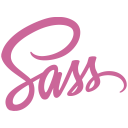

**Welcome to Howard's basement  👋**
<!--
**howardding2000/howardding2000** is a ✨ _special_ ✨ repository because its `README.md` (this file) appears on your GitHub profile.

Here are some ideas to get you started: -->

**Here some informations about me:**  
---
- Bachelor degree in software engineering:man_student:
- 2 years feature phone :iphone: development experience （ancient technology :sweat_smile:	）
- 6 years project management experiencein in mobile device manufacturing（PMP Certification）:briefcase::necktie::pencil:
- DEP of Machining Technique ( cours en français):toolbox::hammer_and_wrench::gear:
- __I’m recently searching a job as a web frontend developer__:heart_eyes::heart_eyes::heart_eyes:
- Welcome to visite my website <a href="https://www.buding.ca">buding.ca</a>, although it's still under construction :sweat_smile::sweat_smile::sweat_smile:
<!-- __I’m currently coding with Reactjs, TypeScript, Nextjs, Chakra UI__ :computer::computer_mouse::muscle:-->
**Languages and Tools:**  
---

<a href="#"></a>
<a href="#"></a>
<a href="#"></a>
<a href="#"></a>
<a href="#"></a>
<a href="#"></a>
<a href="#"></a>
<a href="#"></a>
<a href="#"></a>
<!--<a href="#"></a>-->
<a href="#"></a>
<a href="#"></a>
<a href="#"></a>
<a href="#"></a>
<a href="#"></a>
<a href="#"></a>
<a href="#"></a>
<a href="#"></a>
<a href="#"></a>
<a href="#"></a>
<!--<a href="#"></a>-->
<!--<a href="#"></a>-->
<!--<a href="#"></a>-->


**My Stats:**  
---
[](#)

<!--START_SECTION:waka-->


**🐱 My GitHub Data** 

> 🏆 457 Contributions in the Year 2022
 > 
> 📦 13.8 kB Used in GitHub's Storage 
 > 
> 🚫 Not Opted to Hire
 > 
> 📜 13 Public Repositories 
 > 
> 🔑 2 Private Repositories  
 > 
**I'm an Early 🐤** 

```text
🌞 Morning    97 commits     ████░░░░░░░░░░░░░░░░░░░░░   16.47% 
🌆 Daytime    224 commits    █████████░░░░░░░░░░░░░░░░   38.03% 
🌃 Evening    268 commits    ███████████░░░░░░░░░░░░░░   45.5% 
🌙 Night      0 commits      ░░░░░░░░░░░░░░░░░░░░░░░░░   0.0%

```
📅 **I'm Most Productive on Wednesday** 

```text
Monday       89 commits     ███░░░░░░░░░░░░░░░░░░░░░░   15.11% 
Tuesday      95 commits     ████░░░░░░░░░░░░░░░░░░░░░   16.13% 
Wednesday    117 commits    █████░░░░░░░░░░░░░░░░░░░░   19.86% 
Thursday     73 commits     ███░░░░░░░░░░░░░░░░░░░░░░   12.39% 
Friday       79 commits     ███░░░░░░░░░░░░░░░░░░░░░░   13.41% 
Saturday     60 commits     ██░░░░░░░░░░░░░░░░░░░░░░░   10.19% 
Sunday       76 commits     ███░░░░░░░░░░░░░░░░░░░░░░   12.9%

```


📊 **This Week I Spent My Time On** 

```text
⌚︎ Time Zone: America/New_York

💬 Programming Languages: 
JavaScript               15 hrs 46 mins      ███████████████████████░░   95.37% 
JSON                     28 mins             ░░░░░░░░░░░░░░░░░░░░░░░░░   2.88% 
LESS                     9 mins              ░░░░░░░░░░░░░░░░░░░░░░░░░   0.96% 
Markdown                 3 mins              ░░░░░░░░░░░░░░░░░░░░░░░░░   0.36% 
HTML                     1 min               ░░░░░░░░░░░░░░░░░░░░░░░░░   0.18%

🔥 Editors: 
VS Code                  16 hrs 32 mins      █████████████████████████   100.0%

🐱‍💻 Projects: 
react-dashboard          13 hrs 41 mins      ████████████████████░░░░░   82.69% 
Unknown Project          1 hr 43 mins        ██░░░░░░░░░░░░░░░░░░░░░░░   10.39% 
react-dashboard-server   33 mins             ░░░░░░░░░░░░░░░░░░░░░░░░░   3.37% 
react-tranning           18 mins             ░░░░░░░░░░░░░░░░░░░░░░░░░   1.88% 
admin-server_final       16 mins             ░░░░░░░░░░░░░░░░░░░░░░░░░   1.66%

💻 Operating System: 
Windows                  16 hrs 32 mins      █████████████████████████   100.0%

```


 Last Updated on 16/04/2022 05:15:24 UTC
<!--END_SECTION:waka-->

<!-- need to replace the icon sources

[](#)

- 👯 I’m looking to collaborate on ...
- 🤔 I’m looking for help with ...
- 💬 Ask me about ...
- 📫 How to reach me: ...
- 😄 Pronouns: ...
- ⚡ Fun fact: ...
-->
